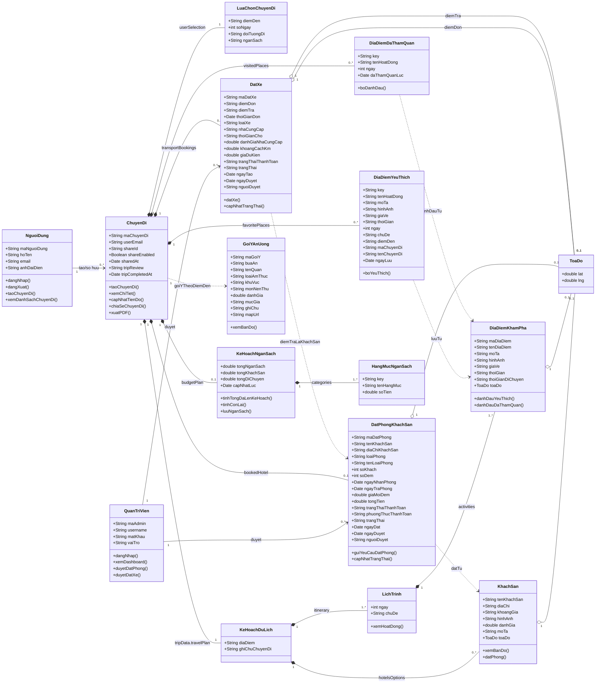

# TripBuddy Class Diagram

> Database hien tai dung Firestore collection `trips-ai`. Moi document trong collection nay la mot `ChuyenDi`; cac phan nhu lich trinh, khach san, booking, dia diem yeu thich... dang la object/array long trong document.

## Mermaid



## Mapping voi Firestore

```text
trips-ai/{tripId}
  id
  userEmail
  userSelection
    destination
    noOfDays
    traveler
    budget
  tripData.travelPlan
    location/tripNote
    hotelsOptions[]
    itinerary[]
      dayNumber/theme
      activities[]
  bookedHotel
  transportBookings[]
  favoritePlaces{activityKey}
  visitedPlaces{activityKey}
  budgetPlan
    totalBudget/categories[]/hotelTotal/transportTotal/updatedAt
  tripReview
  tripCompletedAt
  shareId/shareEnabled/sharedAt
```

## Ghi chu thiet ke

- `NguoiDung` khong phai collection rieng trong Firestore hien tai; app lay user tu Google OAuth va luu `userEmail` vao `ChuyenDi`.
- `QuanTriVien` hien dang la tai khoan tu bien moi truong/localStorage, khong phai collection rieng.
- `GoiYAnUong` hien dang duoc tinh tu component theo `destination` va `budget`; neu muon luu vao database thi co the them field `foodSuggestions[]` trong document trip.
- `DatPhongKhachSan`, `DatXe`, `DiaDiemYeuThich`, `DiaDiemDaThamQuan`, `KeHoachNganSach` la du lieu con cua `ChuyenDi`, nen trong UML dung composition `*--`.
